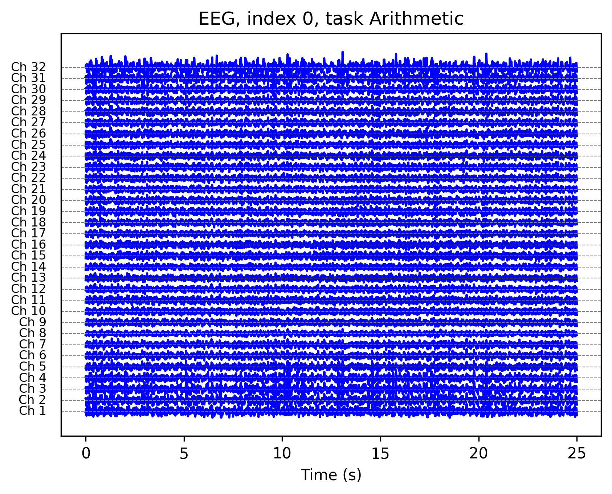
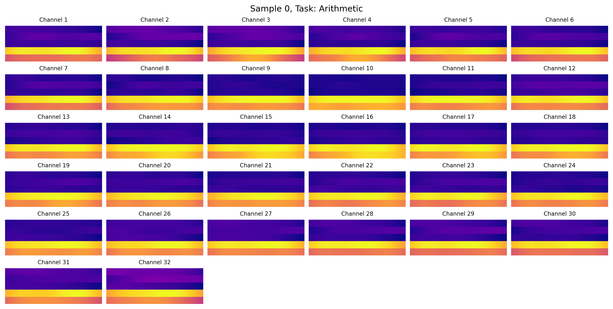
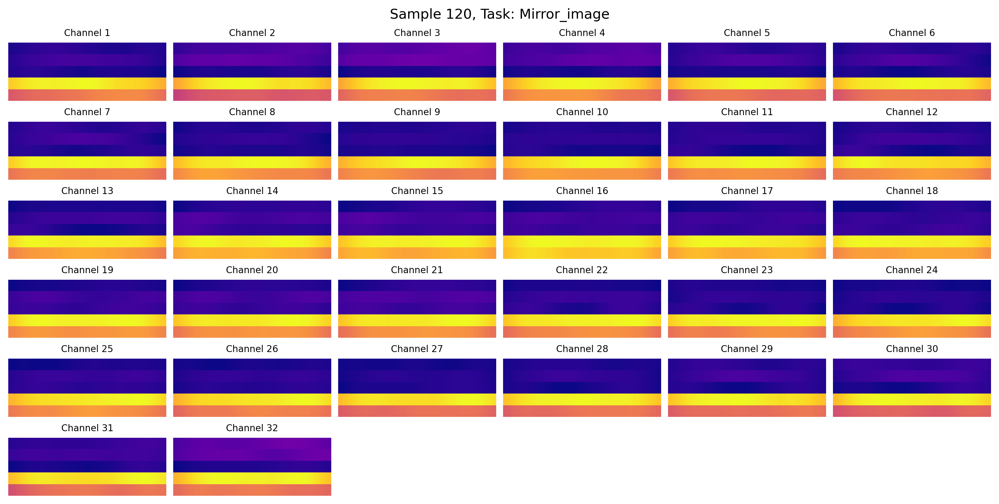
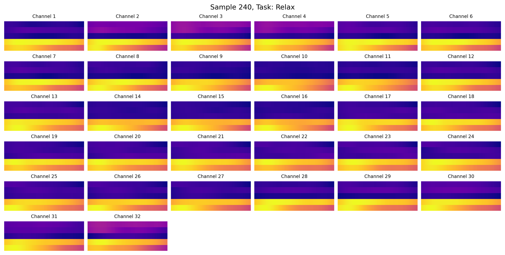
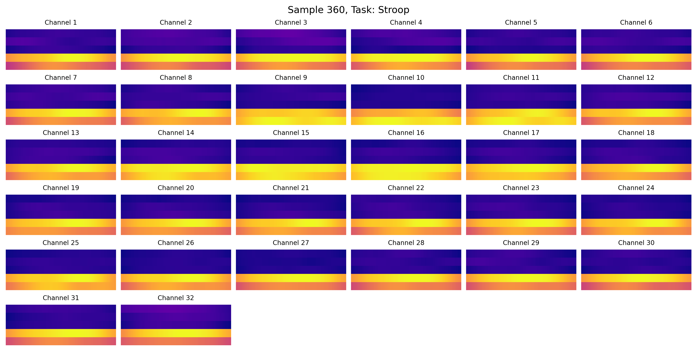
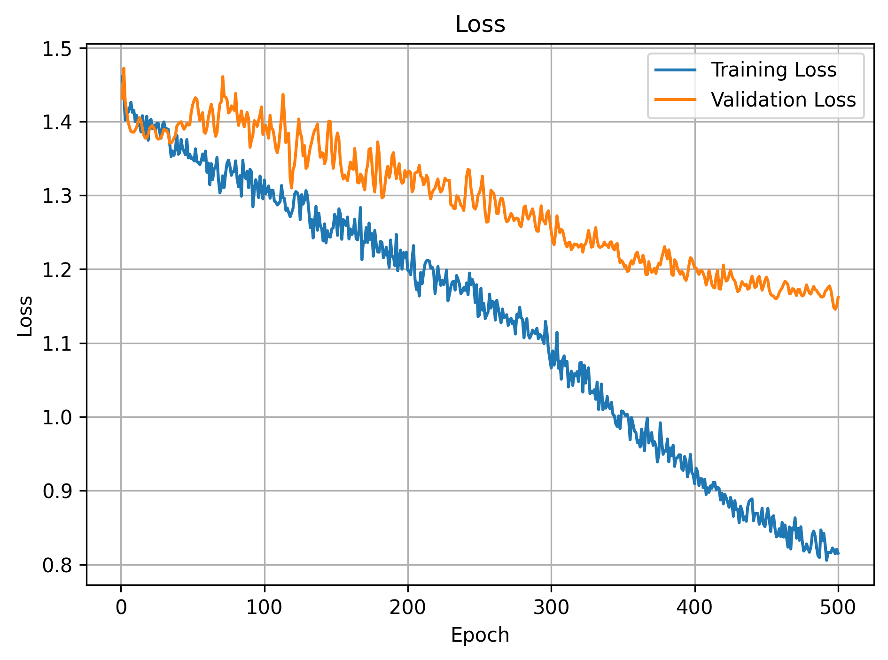
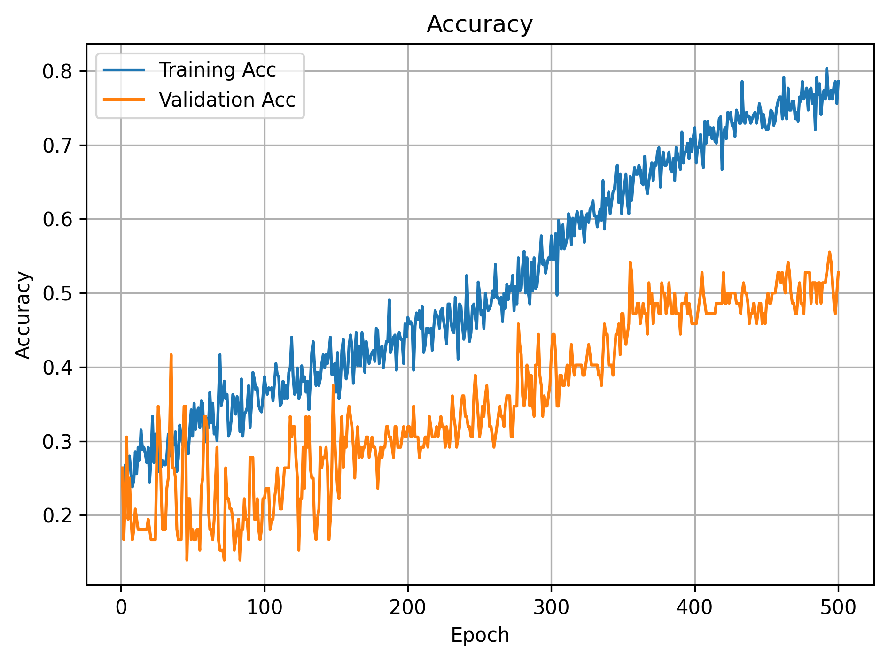
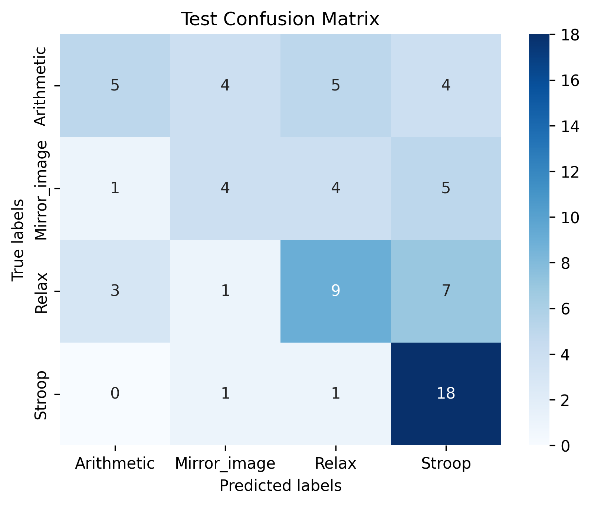

# The SAM40 Dataset

It consists of electroencephalograms (EEG) of people while they perform tasks.

You can find the dataset [here](https://figshare.com/articles/dataset/SAM_40_Dataset_of_40_Subject_EEG_Recordings_to_Monitor_the_Induced-Stress_while_performing_Stroop_Color-Word_Test_Arithmetic_Task_and_Mirror_Image_Recognition_Task/14562090)

We extract the dataset to obtain 480 samples (120 for each task among Stroop, Relax, Mirror_Image, and Arithmetic).
Each sample has the record of the 32 electrods of the EEG over 25 seconds at 128Hz (3200 points)

## Preprocessing

We don't want to feed the raw inputs to our model, we will extract features from it.

The approach used was to use a time-frequency spectrogram with the alpha, beta, gamma, delta and theta bands (those are intervals in the frequency domain).

After the preprocessing step we have a 32 channels 5x101 image for each sample. 5 corresponds to the 5 frequency intervals and 101 are the time intervals.

Arithmetic task example: 

Mirror Image task example:

Relax task example:

Stroop task example:

## The model

Here are the layers of the model: 
- BatchNorm2d

- Conv2d          
32 to 128 channels, kernel_size of 5, stride 1, padding 2

- Dropout2d       
0.3 probability of channel dropout

- BatchNorm2d

- ReLU

- Conv2d          
128 to 64 channels, kernel_size of 5, stride 1, padding 2

- Dropout2d       
0.2 probability of channel dropout

- BatchNorm2d

- ReLU

- Conv2d          
64 to 32 channels, kernel_size of 5, stride 1, padding 2

- Dropout2d       
0.2 probability of channel dropout

- BatchNorm2d

- ReLU

- Flatten

- Fully-Connected 
32*101*5 to 128 layers

- Dropout         
0.5 probability of neuron dropout

- BatchNorm

- ReLU

- Fully-Connected 
128 to 4 layers

- SoftMax loss

## The training

- Adam optimizer was used
- L2 regularization added to the loss
- Every epoch, the learning rate is reduced by 1%

We trained over 1000 epochs, it was enough to have a stable loss:

We have profiles of accuracy where we can see no clear overfittng.

# The results

We achieved 56.94% accuracy on the test dataset, with the following confusion matrix:

We can see that our model is very good (90% accuracy) at classifying the stroop effect but is pretty bad for the other tasks, especially the arithmetic task.