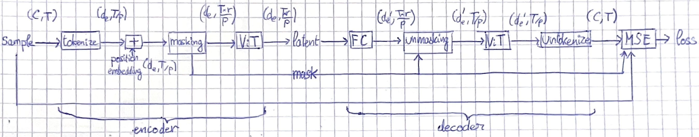
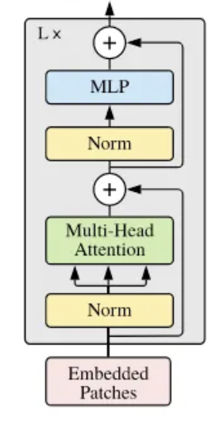

# DreamDiffusion Pipeline

## EEG Pre-train

We need an encoder for EEGs.

We train a Masked AutoEncoder (MAE), it encodes EEG to a low dimension latent space, then it decodes that latent vector to another EEG. We want the reconstructed EEG to match the input one. For better results part of the input is masked.

Here is the pipeline:

With the following variables:
- $C$: Number of input channels = 128
- $T$: Time length (number of EEG time points) = 440
- $p$: Patch size = 8
- $d_e$: Embedding dimension = 1024
- $r$: Masking ratio = 0.1
- $D$: Encoder depth = 24
- $D'$: Decoder depth = 8
- $n_h$: Number of heads for encoding = 16
- $n_h'$: Number of heads for decoding = 16

### Layers

- Tokenize:
  
  To tokenize the EEG, a 1D Convolution with $C$ input channels, $d_e$ output channels, $p$ stride and kernel_size is applied. This is equivalent to dividing the time signal into patches, applying a functional to make a token out of the patch, and then applying a fully connected neural network.

- Position embedding:
  
  A sin-cos position embedding is used, we add it to the layer so the transformer can have a clue of the patch index it is dealing with

- Masking: 
  
  The random masking with probability $r$ will mask a portion of $r$ of the patches for each channel. Giving an output of shape $(d_e, r\times T/p)$, and the mask it used so it is possible to build the input back from the output.

- Encoding Vision Transformer:
  
  
  

  The depth is $D$ (Instead of L in the diagram), the Norm layers are LayerNorm layers, the Multi-Head Attention has $n_h$ attention heads. The MLP has just one hidden layer.

- Unmasking:
  
  The inverse operation of masking

- Decoding Vision Transformer:
  
  Has depth $D'$ and $n_h'$ attention heads.

- Untokenize:
  
  A simple Linear layer and a reshape is used to untokenize. The output shape of the Linear layer is $(C\times p, T/p)$ and after reshape we have $(C, T)$.

- MSE:
  
  The Mean Square Error is used to calculate the loss. It is calcluated on the masked parts only.